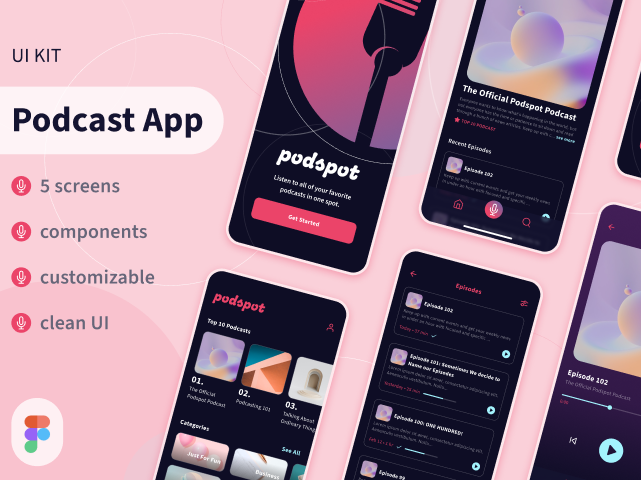
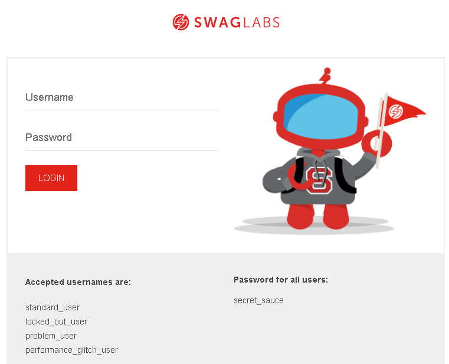

# Portfólio
Este projeto tem como finalidade mostrar o meu trabalho de análise de requisitos e plano de teste

Neste repositório você irá encontrar a análise de dois (2) projetos, sendo um:

- Análise de requisitos de um protótipo Figma
-  Plano de Teste de um site

## Portfólio Análise de Requisitos

- Protótipo do Figma [PodcastApp](https://www.figma.com/design/ECIzSfAWHcPJSi3HxkKdUr/PodcastAppChallenge?m=auto&t=WBSxPDFw8EJ0oCFy-1)
  

## Portfólio Plano de Teste

- Site utilizado para elaboração do Plano [Saucedemo](https://www.saucedemo.com/v1/)

