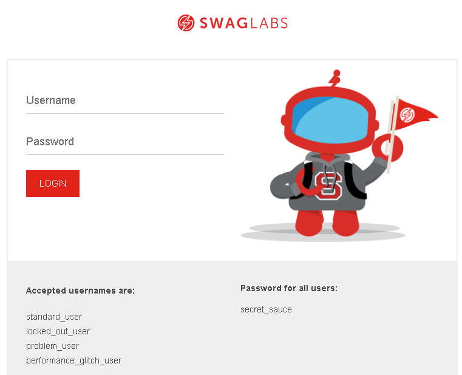
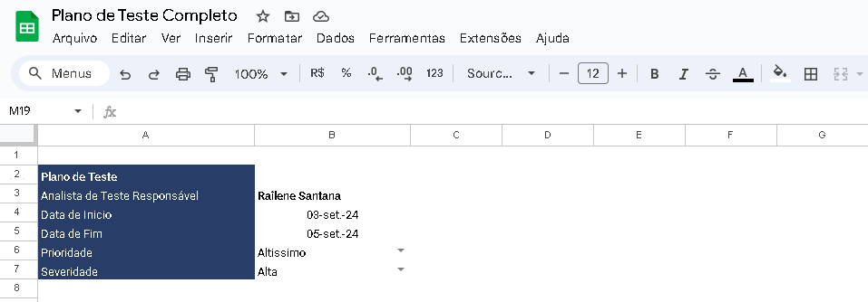
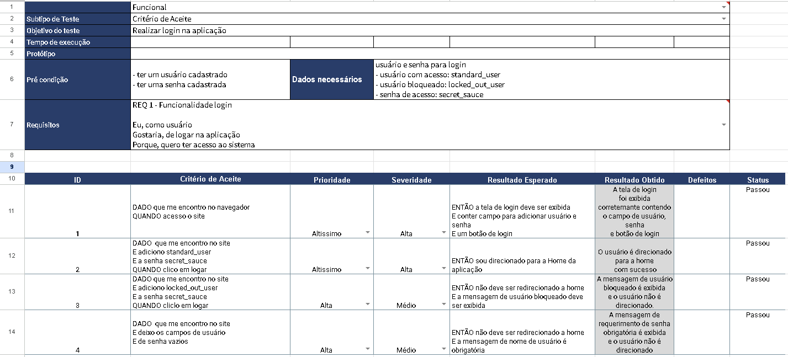
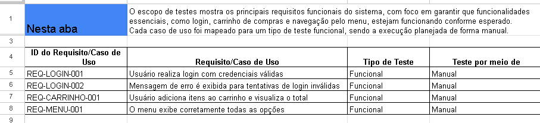
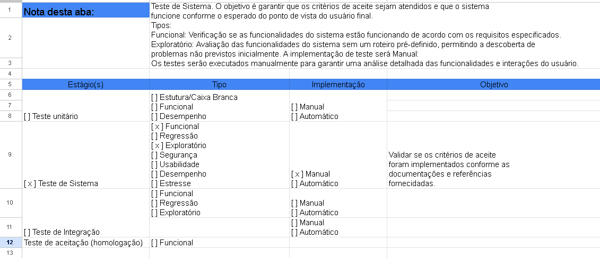
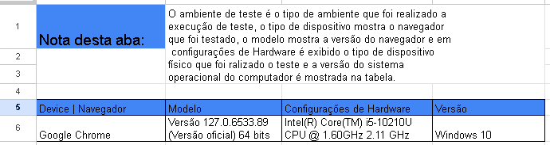
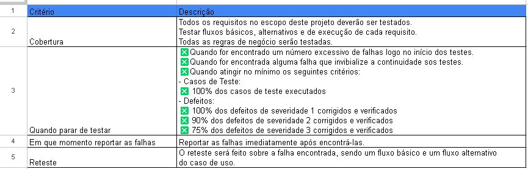

# Projeto Podcast APP

Este projeto foi criado com o propósito de praticar a criação e execução do **Plano de Teste** de um projeto. Onde foi levado em consideração analisar um site já existente, realizar levantamento  dos seus requisitos, criação de suítes e casos de teste para a execução.

## Ferramentas

- Site utilizado para elaboração do Plano [Saucedemo](https://www.saucedemo.com/v1/)

- Excel para criação do Plano de Teste
  

## Plano de Teste

### Apresentação do Plano
 
Na aba introdução da planilha, irá conter todas as informações base do projeto.

## Apresentando a Suíte

Na aba **suíte login** irá conter todas as informações necessárias para a execução dos testes vinculados à suíte.

### Objetivo do Teste

O objetivo do teste da suíte de login é verificar se o usuário loga corretamente no sistema.

### Tempo de Execução

O tempo de execução dos testes da suíte de login teve a duração de **5 minutos**.

### Protótipo

A importância do protótipo das telas é para auxiliar o time sobre como será a tela do sistema e seus fluxos de sucesso e validação de mensagens de erro.

### Pré-condição

A pré-condição na suíte de teste é utilizada para auxiliar em uma condição para o andamento do processo de teste.

### Dados Necessários

Os dados necessários são utilizados para auxiliar no processo de teste. Durante a execução, esses dados são indispensáveis para validar os testes corretamente.

### Critério de Aceite

Os **critérios de aceite** validam se a implementação de uma user story atende às expectativas do usuário. Eles garantem que o sistema funcione de acordo com o planejado.

### Requisitos

Os requisitos foram criados com base em **histórias de usuários** e são utilizados como uma forma de trazer o desejo do usuário para determinada funcionalidade. Eles servem como guia para garantir que o sistema entregue solucione os problemas ou demandas identificadas.

### Casos de Teste

Um **caso de teste** descreve as condições e passos detalhados para verificar se uma funcionalidade do sistema funciona conforme os requisitos. O objetivo é validar se o sistema está funcionando conforme o esperado.

**Nível de Detalhe**: Um caso de teste é mais detalhado do que um critério de aceite. Ele inclui:
- Passos específicos
- Dados de teste
- Pré-condições
- Resultados esperados e obtidos

### Prioridade

Se refere à **urgência** na qual um defeito ou funcionalidade deve ser resolvido ou implementado. Um item com alta prioridade deve ser tratado antes que os menos críticos.

### Severidade

A **severidade** está relacionada ao impacto que um defeito pode ter no sistema. Quanto maior a severidade, maior é o dano que o defeito pode causar ao sistema.

## Escopo

Na aba de **escopo de testes** apresento os principais requisitos funcionais do sistema, com foco em garantir que funcionalidades essenciais, como login, carrinho de compras e navegação pelo menu, estejam funcionando conforme esperado. Cada caso de uso foi mapeado para um tipo de teste funcional, sendo a execução planejada de forma manual.	

## Estratégia

Nesta aba, apresento as **estratégias de teste** adotadas para testar o sistema, com foco específico no Teste de Sistema. O objetivo é garantir que os critérios de aceite sejam atendidos e que o sistema funcione conforme o esperado do ponto de vista do usuário final.

## Ambiente de Teste

Nesta aba de **ambiente de teste** apresento tipo de ambiente que foi realizado a
execução de teste, o tipo de dispositivo mostra o navegador
que foi testado, o modelo mostra a versão do navegador e em configurações de Hardware é exibido o tipo de dispositivo físico que foi ralizado o teste e a versão do sistema operacional do computador.	
		
## Critério de aceite

Nesta aba apresento a seção de **critério de aceite** que revela que todos os requisitos foram cobertos, com 16 casos de teste executados e 15 aprovados. Um defeito crítico (ID 16) foi identificado, relacionado ao item não sendo removido corretamente do carrinho, e está em aberto para correção. As falhas foram reportadas e documentadas adequadamente, e os retestes não encontraram novas falhas. Sugere-se adicionar uma mensagem de erro "CEP inválido" para entradas incorretas e melhorar a mensagem de erro para os campos "Nome" e "Sobrenome" para maior clareza.